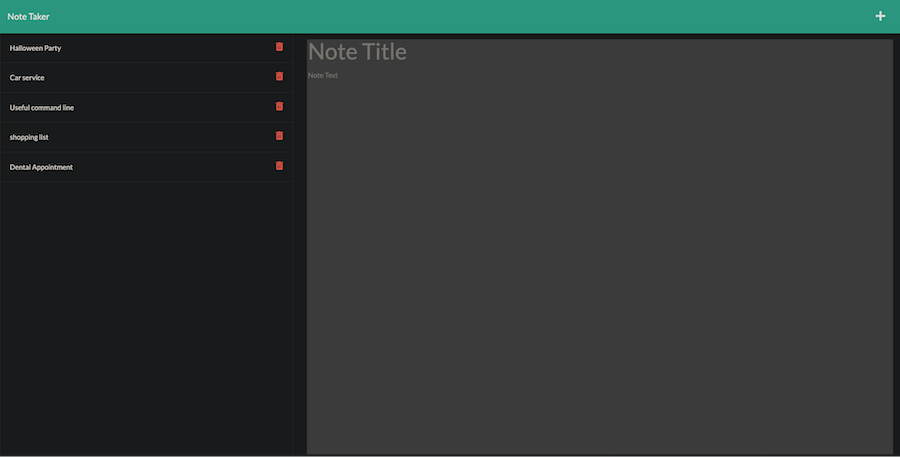

# Note Taker

[](https://opensource.org/licenses/MIT)

Note Taker that can be used to write and save notes.This application will use an Express.js back end and will save and retrieve note data from a Json file.


## Technology
[Express](https://expressjs.com/) for back-end server

## Table of Contents
- [Installation](#installation)
- [Changes](#changes)
- [Usage](#usage)
- [Mock-up](#mock-up)
- [Link](#link)
- [Credit](#credit)
- [Questions](#questions)

## Installation
Install express by using the following command:
```bash
node install
```
Check package.json to see what has been installed
```
   "dependencies": {
    "express": "^4.16.4"
  }
```
## Changes

build the back end, connect the back-end and front-end, and then deploy the entire application to Heroku.

The following HTML routes created:

* `GET /notes` should return the `notes.html` file.

* `GET *` should return the `index.html` file.

The following API routes should be created:

* `GET /api/notes` should read the `db.json` file and return all saved notes as JSON.

* `POST /api/notes` should receive a new note to save on the request body, create unique id and add it to the `db.json` file, and then return the new note to the client. 

* `DELETE /api/notes/:id` should receive a query parameter that contains the id of a note to delete. To delete a note, you'll need to read all notes from the `db.json` file, remove the note with the given `id` property, and then rewrite the notes to the `db.json` file.


## Usage

The application will start by using the following command:
```bash
node server.js
```
Go to [https://localhost:3001](https://localhost:3001)

Application Flow
```
WHEN I open the Note Taker
THEN I am presented with a landing page with a link to a notes page
WHEN I click on the link to the notes page
THEN I am presented with a page with existing notes listed in the left-hand column, plus empty fields to enter a new note title and the note’s text in the right-hand column
WHEN I enter a new note title and the note’s text
THEN a Save icon appears in the navigation at the top of the page
WHEN I click on the Save icon
THEN the new note I have entered is saved and appears in the left-hand column with the other existing notes
WHEN I click on an existing note in the list in the left-hand column
THEN that note appears in the right-hand column
WHEN I click on the Write icon in the navigation at the top of the page
THEN I am presented with empty fields to enter a new note title and the note’s text in the right-hand column
```

## Mock-Up

The following images show the web application's appearance and functionality:

.png)



## Link
[Deployed heroku link](https://notetaker-yeon.herokuapp.com/notes)

[Github Repository](https://github.com/rogseo/noteTaker)

## Credit
Start code from UT boot camp - The application’s front end has already been created

## Questions
if you have more question, reach me out below.
* Github repository : https://github.com/rogseo
* email : rogseo@gmail.com


